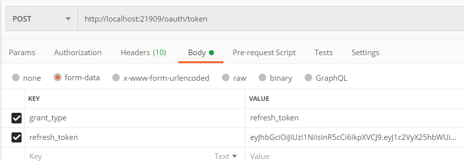

### 前言

​	此框架 是由SpringBoot + Spring Security + Spring Security OAuth2 + Mybatis Plus + Mysql 组成的一套开发认证授权框架。该套框架基于约定大于配置的原则实现了大部分项目开发中需要用到的功能模块，比如接口权限控制JWT Token、App认证、MybatisPlus集成与配置、Swagger成与配置、跨域配置、全局异常处理、API接口实现统一格式返回等等。

​	该框架基于Jdk 1.8、SpringBoot 2.1.8开发，同时遵循《阿里巴巴Java开发手册V1.5》、API接口遵循Restful风格。

### 一、在项目中引入framework框架

**以maven导入方式为例**

#### 1.1 配置jitpack.io的repository

```xml
<repositories>
    <repository>
        <id>jitpack.io</id>
        <url>https://jitpack.io</url>
    </repository>
</repositories>
```

#### 1.2依赖smm框架

```xml
<dependency>
    <groupId>com.github.ti-amero-ng</groupId>
    <artifactId>framework</artifactId>
    <version>Tag</version>
</dependency>
```

##### 拓展：对jitpack.io介绍

- 输入网址[https://jitpack.io](https://jitpack.io/)
- 搜索框中输入ti-amero-ng/framework，可以在当前页面中查看到framework框架所有历史版本以及导入方式

### 二、功能使用说明

#### 2.1 跨域请求配置

​	继承`GlobalCorsConfig`

```java
@Configuration
@EnableWebMvc
public class CorsConfig extends GlobalCorsConfig {

}
```

#### 2.2 全局异常处理

​	继承`GlobalExceptionHandler`

```java
@ControllerAdvice
@Component
public class ExceptionHandler extends GlobalExceptionHandler {

}
```

##### 2.3 mybatis plus配置

​	继承`GlobalMybatisConfig`

```java
@Configuration
public class MybatisPlusConfig extends GlobalMybatisConfig {

}
```

#### 2.4 Swagger文档配置

​	继承`GloablSwaggerConfig`

```java
@Configuration
@EnableSwagger2
public class SwaggerConfig extends GloablSwaggerConfig {

}
```

##### 2.4.1 设置是否开启Swagger

​	Swagger通常只在本地开发环境或内网测试环境开启，生产环境中Swagger一般都是需要关闭的。因此我们提供了一个抽象方法boolean swaggerEnable()需要你来指定Swagger是否开启，通常这个开关配置在配置文件中，开发环境设置为true,生产设置成false，如下：

```java
@Configuration
@EnableSwagger2
public class SwaggerConfig extends GloablSwaggerConfig {
    @Value("${swagger.enable}")
    private boolean enable;

    @Override
    public boolean swaggerEnable() {
        return enable;
    }
}
```

##### 2.4.2 设置多个Docket

​	有时候API会分为多个模块，因此需要对API进行分组显示，此时可以重写`configureSwaggerApiInfo()`方法，返回多个你需要的ApiInfo，例如：

```java
@Override
protected List<SwaggerApiInfo> configureSwaggerApiInfo() {

    List<SwaggerApiInfo> swaggerApiInfos = new ArrayList<>();

    SwaggerApiInfo userModelApiInfo = new SwaggerApiInfo("用户模块API接口文档","com.netx.user.controller","V1.0");
    swaggerApiInfos.add(userModelApiInfo);

    SwaggerApiInfo lawyerModelApiInfo = new SwaggerApiInfo("律师模块API接口文档","com.netx.lawyer.controller","V1.0.1");
    swaggerApiInfos.add(lawyerModelApiInfo);

    return swaggerApiInfos;
}
```

​	暂时最多支持配置10个Docket，正常情况下10个已经足够了，如果需要，框架还能提供更多的配置数量。

#### 2.5 接口权限控制配置

##### 2.5.1 实现接口`UserDetailsService`,重写`loadUserByUsername()`方法，查询数据库返回`UserDetails`

​	密码加密方式默认用的是`BCryptPasswordEncoder`

```java
@Service
public class UserDetailServiceImpl implements UserDetailsService {
	@Autowired
    private BCryptPasswordEncoder bCryptPasswordEncoder;

    @Autowired
    IUserAdminService userAdminServiceImpl;

    @Override
    public UserDetails loadUserByUsername(String userName) throws UsernameNotFoundException {
        String password = bCryptPasswordEncoder.encode(userAdminServiceImpl.getUserPassword(userName));
        return new User(userName, password, getAuthority());
    }

    private List getAuthority() {
        return Arrays.asList(new SimpleGrantedAuthority("ROLE_ADMIN"));
    }
}
```

##### 2.5.2 继承`GlobalWebSecurityConfigurer`

```java
@Configuration
@Order(SecurityProperties.BASIC_AUTH_ORDER)
public class WebSecurityConfigurer extends GlobalWebSecurityConfigurer {

}
```

##### 2.5.3 继承`OAuth2AuthorizationServerConfig`，OAuth2认证服务器配置

```java
@Configuration
public class Oauth2AuthentizationConfig extends OAuth2AuthorizationServerConfig {

}
```

##### 2.5.4 继承`OAuth2ResourceServerConfig`,OAuth2资源服务器，该类配置了自定义登录和短信验证码登录

```java
@Configuration
public class Oauth2ResoucesConfig extends OAuth2ResourceServerConfig {
    
}
```

##### 2.5.5 指定某种环境下关闭接口权限校验

​	为了方便开发，一般我们在本地开发环境中会关闭接口权限校验，重写资源服务配置`OAuth2ResourceServerConfig`下的`customCloseAuthorityEvironment()`方法，你可以指定某种环境下关闭接口权限校验，如下：

```java
@Configuration
public class Oauth2ResoucesConfig extends OAuth2ResourceServerConfig {

    @Value("${spring.profiles.active}")
    private String currentRunEnvironment;

    /**
     * 指定某种运行环境下关闭权限校验；为了方便开发，一般我们的dev环境会关闭接口权限校验
     * @return
     */
    @Override
    public CloseAuthorityEvironment customCloseAuthorityEvironment(){
        return new CloseAuthorityEvironment(currentRunEnvironment,"dev");
    }
}
```

##### 2.5.6 自定义放行接口

​	如果你需要指定某些接口要放行，你可以重写重写资源服务配置`customConfigure(HttpSecurity http)`，通过HttpSecurity设置放行接口，然后返回设置后的HttpSecurity

```java
/**
 * @author -Huang
 * @create 2020-03-20 13:15
 */
@Configuration
public class Oauth2ResoucesConfig extends OAuth2ResourceServerConfig {
    @Value("${spring.profiles.active}")
    private String currentRunEnvironment;

    /**
     * 用户自定义配置，子类可覆盖自定义实现
     * @param http
     * @throws Exception
     */
    @Override
    protected HttpSecurity customConfigure(HttpSecurity http) throws Exception{
        http.cors().and().csrf().disable().authorizeRequests()
                .antMatchers("/verify-code").permitAll()
                .anyRequest().authenticated();
        return http;
    }

    /**
     * 指定某种运行环境下关闭权限校验；为了方便开发，一般我们的dev环境会关闭接口权限校验
     * @return
     */
    @Override
    public CloseAuthorityEvironment customCloseAuthorityEvironment(){
        return new CloseAuthorityEvironment(currentRunEnvironment,"dev");
    }
}
```

```java
/**
 * 在资源服务器中配置第三方应用访问权限，第三放client拥有scopes权限则可以访问	
 * 用户自定义配置，子类可覆盖自定义实现
 * @param http
 * @throws Exception
 */
@Override
protected HttpSecurity customConfigure(HttpSecurity http) throws Exception{
    http.cors().and().csrf().disable().authorizeRequests()
        .antMatchers("/code").permitAll()
        .antMatchers( "/read").access("#oauth2.hasScope('read')")
        .antMatchers( "/write").access("#oauth2.hasScope('write')")
        .anyRequest().authenticated();
    return http;
}
```

##### 2.5.7 OAuth2参数配置

- 1、继承`SecurityProperties`

```java
@Component
public class FrameworkProperties extends SecurityProperties {
    
}
```

- 2、继承`TokenStoreConfig`使token配置生效,token存储默认使用jwt，通过配置可修改为redis存储

```java
@Component
public class TokenConfig extends TokenStoreConfig {
    
}
```

- 配置client参数

```yml
#spring security oauht2  参数说明见2.5.10
framework:
  security:
    oauth2:
      clients[0]:
        clientId: client
        clientSecret: clientSecret
        accessTokenValiditySeconds: 604800
        refreshTokenValiditySeconds: 2592000
        authorizedGrantTypes: ["refresh_token", "password"]
        redirectUris: "http://example.com"
        scopes: ["all", "read", "write"]
      tokenStore: jwt
      jwtSigningKey: jwtSecret
```

##### 2.5.8 OAuth2登录

​	登录接口及刷新token接口都需要设置Authorization为Basic Auth，其余接口设置请求头Authorization参数为token进行访问，密码登录及验证码登录只接受Json格式登录，设置请求头` Content-Type `为` application/json `

- 1、密码登录 ， path: " http://localhost:8080/login "

  - 设置Authorization

    

  - 设置请求头` Content-Type `为` application/json `

  - 参数

    ```json
    {
    	"username":"username",
    	"password":"password"
    }
    ```

- 2、短信验证码登录，path: " http://localhost:8080/login/mobile "

  - 设置Authorization

    

  - 设置请求头` Content-Type `为` application/json `

  - 参数

  ```json
  {
  	"smsCode" :"code",
  	"mobile":"mobile"
  }
  ```

- 刷新token,path:" http://localhost:8080/oauth/token "

  - 设置设置Authorization

  

  - 参数
  - 

##### 2.5.9 自定义授权页面

​	1、定义授权页面视图

```java
@Controller
@SessionAttributes({ "authorizationRequest" })
public class OAuthController {

    @RequestMapping("/custom/confirm_access")
    public ModelAndView getAccessConfirmation(Map<String, Object> model, HttpServletRequest request) throws Exception {
        AuthorizationRequest authorizationRequest = (AuthorizationRequest) model.get("authorizationRequest");
        ModelAndView view = new ModelAndView();
        view.setViewName("base-grant");
        view.addObject("clientId", authorizationRequest.getClientId());
        return view;
    }
}
// http://localhost:8080/oauth/authorize?response_type=code&client_id=client&redirect_uri=http://www.example.com&scope=all 
```

​	2、在配置文件中配置授权页面路径

```yml
framework:
  security:
    oauth2:
      confirm_url: "/custom/confirm_access"
```

##### 2.5.10 framework参数配置说明

```yml
framework:
  security:
    oauth2:
    # 配置认证服务器，可以配置多个clients
      clients:
        -
          clientId: client	#客户端id
          clientSecret: 123qwe #客户端密码
          accessTokenValiditySeconds: 604800	#token过期时间
          # 客户端授权模式
          authorizedGrantTypes: ["refresh_token", "password","authorization_code"]
          # 回调地址
          redirectUris: "http://example.com"
          # 客户端权限
          scopes: ["all", "read", "write"]
        -
          clientId: client2
          clientSecret: 123qwe
          accessTokenValiditySeconds: 604800
          authorizedGrantTypes: ["refresh_token", "password","authorization_code"]
          redirectUris: "http://example.com"
          scopes: ["all", "read", "write"]
      # token存储类型 默认是jwt 也可以配置为redis
      tokenStore: jwt
      # token秘钥
      jwtSigningKey: secret
      # 授权页面路径 不设置默认oauth2授权页面
      confirm_url: "/custom/confirm_access"
      # token增强信息 可配置多个
      tokenInfo:
        author: "Huang"
        project: "test-framework"
```

#### 2.6 Restful API 返回统一的数据格式到前端

##### 2.6.1 framework框架中，统一返回到前端的格式是ResponseResult

```java
public class ResponseResult {
    private int code;
    private String msg;
    private Object data;
}
```

##### 2.6.2 server端的异常也会被全局拦截，统一返回ResponseResult格式

参见2.2

##### 2.6.3 全局拦截Controller层API，对所有返回值统一包装成ResponseResult格式再返回到前端

继承`GlobalReturnConfig`

```java
@EnableWebMvc
@Configuration
@RestControllerAdvice({"com.netx.web.controller"})
public class ControllerReturnConfig  extends GlobalReturnConfig {

}
```

​	注意：@RestControllerAdvice要设置扫描拦截包名，如：`com.netx.web.controller`，这样就只拦截controller包下的类。否则swagger也会拦截影响swagger正常使用

​	全局拦截后Controller层API不需要显示地返回ResponseResult，因为会全局拦截处理并返回ResponseResult格式，如一下代码

```java
 @ApiOperation("新增代理")
  @PostMapping
  public ResponseResult createAgents(@RequestBody @Valid AddUserAgentVO addUserAgentVO){
      userAgentServiceImpl.saveAgents(addUserAgentVO);
      return ResponseResult.success();
  }
```

可以改成

```java
@ApiOperation("新增代理")
@PostMapping
public void createAgents(@RequestBody @Valid AddUserAgentVO addUserAgentVO){
    userAgentServiceImpl.saveAgents(addUserAgentVO);
}
```

代码

```java
@ApiOperation("获取代理列表")
@GetMapping("/list")
public ResponseResult pageUserAgents(UserAgentSearch search) {
    IPage<UserAgentVO> page = userAgentServiceImpl.pageUserAgents(search);
    return ResponseResult.success(page);
}
```

可以改成

```java
@ApiOperation("获取代理列表")
@GetMapping("/list")
public IPage<UserAgentVO> pageUserAgents(UserAgentSearch search) {
    return userAgentServiceImpl.pageUserAgents(search);
}
```

### 三、framework框架的使用案例
test-framework项目：https://github.com/ti-amero-ng/test-framework
